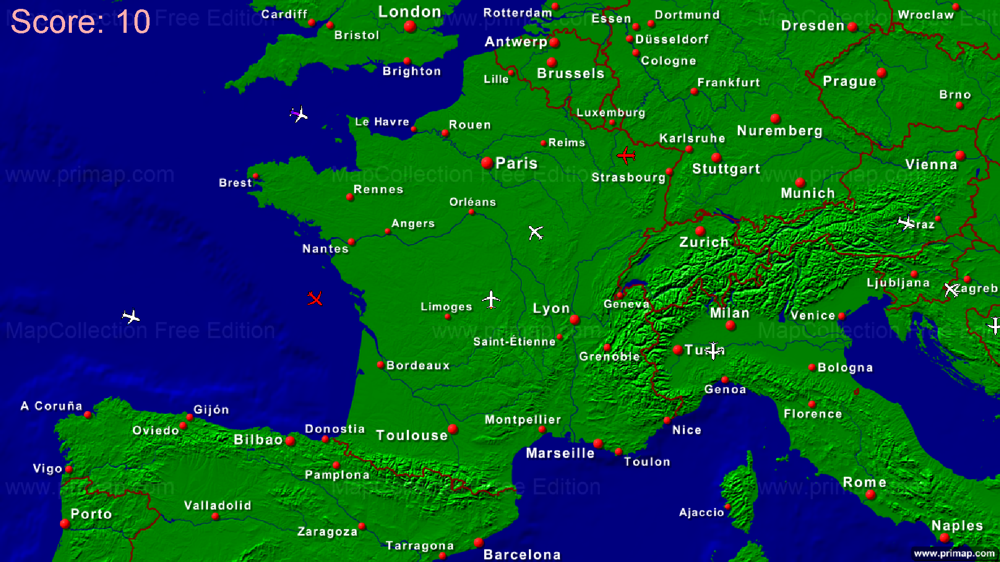
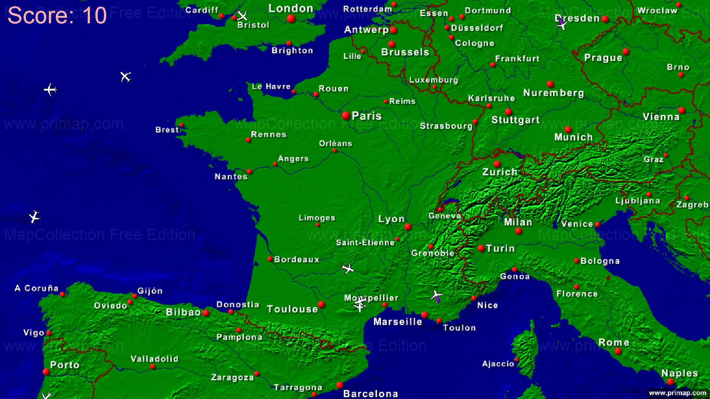

# JetClicker

## Description
Jeu qui consiste à détruire des jets privés trop polluants qui se confondent au milieu des avions de ligne. 
Les jets privés sont présents pendant les quelques premières secondes des niveaux. Le but est de retenir leur position et de les détruire stratégiquement pour éviter de les perdre.

## Visuels
Début du niveau 2 avec les jets affichés :

Niveau 2 après que les jets ont disparu :

## Installation
Installer [Java](https://www.java.com/fr/download/)
Pour quelques raisons (même introuvables par les professeurs), installer le [JDK]([http](https://www.oracle.com/java/technologies/downloads/))

## Comment jouer
- Le but est d'obtenir le meilleur score à la fin des niveaux
- Pour cela, il faut détruire des jets privés
- Ces jets privés n'apparaissent que pendant un court laps de temps au début de chaque niveau
- Il faut donc mémoriser leur position et les détruire stratégiquement afin d'être efficace
- Toucher un avion de ligne recommence le niveau et retire 1 point du score
- Il faut donc réussir à éliminer tous les jets privés sans commettre d'erreur jusqu'à la fin du niveau. Lorsqu'il est passé, cela rapporte 10 points
- Il est donc facile de terminer le jeu, car il est possible de le finir avec un score négatif, sans limites
- La difficulté réside dans le fait de terminer le jeu avec le score maximal, qui est égal à : nombre_niveaux * 10

## Roadmap
- [Opensky](https://opensky-network.org/) est actuellement down, mais le code pour l'intégration au jeu est déjà prêt. Nous attendons simplement que leur API soit de nouveau en ligne.
- Un bouton pour quitter le jeu, différent de Alt+F4, serait une bonne idée.

## Auteurs

|

|

|

|

|
|:-------:|:------:|:----:|:----:|
|[Linares Julien](https://gitlab.univ-lr.fr/jlinares)|[Mulcey Amaury](https://gitlab.univ-lr.fr/amulcey)|[Michard--Melon Colas](https://gitlab.univ-lr.fr/cmichard)|[Menard Ludovic](https://gitlab.univ-lr.fr/lmenar03)|

## Credits
### Opensky:
Matthias Schäfer, Martin Strohmeier, Vincent Lenders, Ivan Martinovic and Matthias Wilhelm.
"Bringing Up OpenSky: A Large-scale ADS-B Sensor Network for Research".
In Proceedings of the 13th IEEE/ACM International Symposium on Information Processing in Sensor Networks (IPSN), pages 83-94, April 2014.
The OpenSky Network, https://opensky-network.org/
